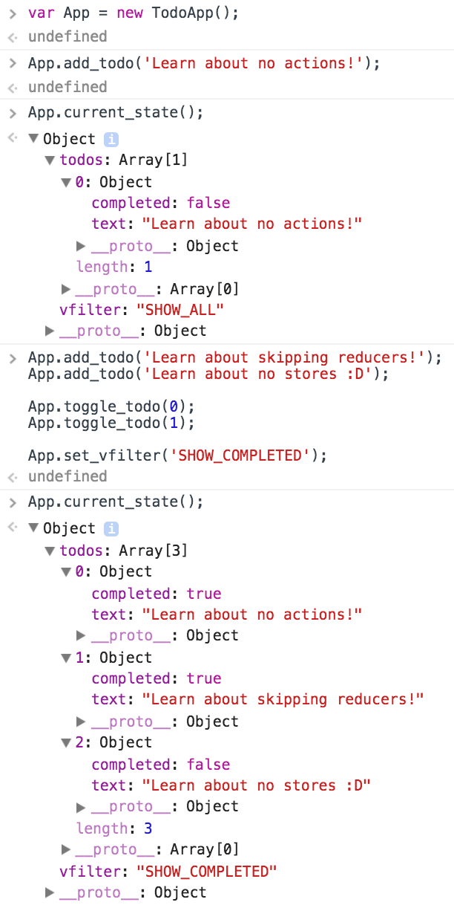

# TODO

* reimplement as reducers at the end
* slide show version?

----

# Walkthrough

We're going to do the [Redux Basics tutorial](http://redux.js.org/docs/basics/)
in parallel with a vanilla implementation.


<br/><br/><br/>
## Getting started

So what we'll do is go through their tutorial's steps, quickly, in both
approaches in parallel, to show how the costs of each approach compare.

### The Redux Way

In `Redux`, you start from an empty page.

```javascript
/* empty */
```

### The Vanilla Way

In `vanilla`, we will choose to start with a class `TodoApp`, which has two
methods: one that triggers a visual re-render, and one that provides the list
of "hooks," which are functions my class offers for communications (essentially
an API contract.)

Render will be an empty function, since we haven't defined any behavior yet.
Hooks will return an empty object, which will eventually contain functions as
described.

```javascript
class TodoApp {
    render = () => { /* do nothing yet */ }
    hooks  = () => { return {}; }
}

export { TodoApp };
```


<br/><br/><br/>
## Actions

In `Redux`, you have `Actions`, which represent messages sent to the `Store` to
manipulate data within the store.  The official `Redux` tutorial starts with
three actions that do nothing but announce themselves, to keep steps admirably
small to make things make sense.

We will instead provide three callback hooks for announcements.

### Redux way

```javascript
export const ADD_TODO              = 'ADD_TODO'
export const TOGGLE_TODO           = 'TOGGLE_TODO'
export const SET_VISIBILITY_FILTER = 'SET_VISIBILITY_FILTER'

export const VisibilityFilters = {
  SHOW_ALL       : 'SHOW_ALL',
  SHOW_COMPLETED : 'SHOW_COMPLETED',
  SHOW_ACTIVE    : 'SHOW_ACTIVE'
};
```

### The Vanilla Way

In vanilla, we choose to have hooks (hooks are just callbacks under a
descriptive name which better indicates that their intent is to create a
callback API for the outside.)

So, we'll instead offer

```javascript
// inside class TodoApp
add_todo(todo)    { /* not yet implemented */ }
toggle_todo(i)    { /* not yet implemented */ }
set_vfilter(vfil) { /* not yet implemented */ }
```

<br/><br/><br/>
## Action creators

In redux, every action comes with a factory function to make examples, called an
"action creator."  They take the time to point out that the phrasing can be
confusing.  Then they point out that theirs work differently than mainstream
Flux, and make still another term, "bound action creators," to refer to Flux
style action creators, which call dispatch once they're used.

Which gets into dispatch, which is later.

In Vanilla, they're just function calls, so there's no need to make anything
to create a function call.

### Redux way

```javascript
export function addTodo(text) {
  return { type: ADD_TODO, text }
}

export function toggleTodo(index) {
  return { type: TOGGLE_TODO, index }
}

export function setVisibilityFilter(filter) {
  return { type: SET_VISIBILITY_FILTER, filter }
}
```

### The Vanilla Way

```javascript
/* nothing is needed here */
```

<br/><br/><br/>
## Data state

The tutorial chooses the following data shape for the application.  To keep
things easy to compare, we will use the same data shape in our vanilla app. I
edited the text, though.

I actually would do this differently in the vanilla app if we weren't trying to
keep things simple to compare.  It's not particularly helpful to stuff all the
state into a single object, unless you're trying to pretend that functional
programming means routing the entire state through a handler for every single
call.

Note that the official tutorial nearly immediately gets into discouraging
heirarchy.  Heirarchy is important, and this reflects one of the many weaknesses
of pretending that your application state is always a key-value store.

```javascript
{
  visibilityFilter: 'SHOW_ALL',

  todos: [
    {
      text: 'Consider *not* using Redux',
      completed: true,
    },
    {
      text: 'You don\'t need libraries to use a tree for state; it\'s just a JS object',
      completed: false
    }
  ]
}
```

<br/><br/><br/>
## Initial state

Next the `Redux` path creates an initial state, and shows how to integrate that
with their reducer behavior step.

We'll just make a class member.

### The Redux way

```javascript
const initialState = {
  visibilityFilter: VisibilityFilters.SHOW_ALL,
  todos: []
}

function todoApp(state, action) {
  if (typeof state === 'undefined') {
    return initialState
  }

  // For now, don't handle any actions
  // and just return the state given to us.
  return state
}
```

### The Vanilla Way

The Vanilla way is a one-liner in the constructor.

```javascript
// inside class TodoApp
constructor() { this.app_state = { vfilter: 'SHOW_ALL', todos: [] }; }
```

We'll also add a convenience one-liner to check the current state.

```javascript
// inside class TodoApp
current_state() { return this.app_state; }
```

<br/><br/><br/>
## Reducers

A concept taken incorrectly from `clojure`, reducers are the way that messages
are to be interpreted by `Redux`.  State is described as an object passed in,
along with the state change message, and the new state passed back out is a
distinct derived state.

In some ways this is appealing.  However, you don't need redux for this in any
way.  We'll re-implement the vanilla app as reducers at the end, but for now
we're showing the no-nonsense approach, so, let's just be direct, the first
time; we can go for the fancy way later.

It's worth noting that while they talk a good game about this turning the
application into a no-state calculation, that isn't actually true; this sets up
extensive bindings throughout the application, imposes the `react` facility
called `state` (different, confusingly, from `Redux state`) on the controls
where it need not exist, and seems to take the position that somehow without its
imposition, you can't have pure functional `react`, when indeed it doesn't work
under `react`'s pure functional controls.

Note also that they immediately mention the need for involving side effects, but
also say that it's difficult and belongs in the advanced tutorial.  This is two
warnings at once: one, that they actually know this isn't a pure function at
all, since they have a direct tutorial on how to involve side effects, which are
the defining difference of pure functions; and two, that side effects, which are
literally the entire purpose of a function that takes a state and returns a new
state on application of a message, are difficult to interleave.  Sadly, this is
most of what a web application does in code, since everything else is
declarative.  Management structures which make common behaviors more difficult
are nearly always a net lose.

Note that they next switch into another long discussion of boilerplate, how
some people don't like `switch`, how they want you to use something that some
browsers don't implement, so you need a shim or a library, insist that code in
front of your face isn't real boilerplate and invoke their reducing boilerplate
document at the same time, et cetera.

### The Redux Way

We augment our reducer to add the ability to provide a new mutated state.

```javascript
function todoApp(state = initialState, action) {
  switch (action.type) {
    case SET_VISIBILITY_FILTER:
      return Object.assign({}, state, {
        visibilityFilter: action.filter
      })
    default:
      return state
  }
}
```

That switch grows by a case for every single message.  Anything you build in
another file needs to go through here.

### The Vanilla Way

We just set the member variable.

```javascript
// inside class TodoApp
set_vfilter = vfil => appstate.vfilter = vfil
```

<br/><br/><br/>
## Two more actions

You can see how rapidly this boilerplate scales.

Notice that just to update a todo, they are now advocating that you involve data
management solutions like `immutability-helper`, `updeep`, or `immutable.js`.
Consider how quickly this will get out of control, if a simple data change means
you need data management libraries for your data management layer.

### The Redux Way

At three actions:

```javascript
function todoApp(state = initialState, action) {
  switch (action.type) {

    case SET_VISIBILITY_FILTER:
      return Object.assign({}, state, {
        visibilityFilter: action.filter
      })

    case ADD_TODO:
      return Object.assign({}, state, {
        todos: [
          ...state.todos,
          {
            text: action.text,
            completed: false
          }
        ]
      })

    case TOGGLE_TODO:
      return Object.assign({}, state, {
        todos: state.todos.map((todo, index) => {
          if (index === action.index) {
            return Object.assign({}, todo, {
              completed: !todo.completed
            })
          }
          return todo
        })
      })

    default:
      return state

  }
}
```

### The Vanilla Way

It's just three simple member-setting one-liners (filling out the empties from earlier)

```javascript
add_todo(todo)    { this.app_state.todos.push(todo); }
toggle_todo(i)    { this.app_state.todos[i].completed = !this.app_state.todos[i].completed; }
set_vfilter(vfil) { this.app_state.vfilter = vfil; }
```

<br/><br/><br/>
## Composer reduction
Now, at three actions for the entire app, the `Redux` tutorial talks about
keeping things easier to comprehend, and starts advocating subdividing your
central function for updates, just previously held up as the reason this was
easy to understand.  They talk about `reducer composition` as a central behavior
of a `Redux` app.

Because if there's one thing you want in a data layer that's meant to keep
things simple with no boilerplate in a pure function, it's a tutorial that
starts showing complexity reduction strategies with three simple calls while
discussing that managing its complexity is a core behavior of downstream apps,
after referring to its impurity tactics as an advanced topic.


### The New Simpler Redux Way

After three simplifications, they come up with this longer, more complex code.

```javascript
import { combineReducers } from 'redux'
import { ADD_TODO, TOGGLE_TODO, SET_VISIBILITY_FILTER, VisibilityFilters } from './actions'
const { SHOW_ALL } = VisibilityFilters

function visibilityFilter(state = SHOW_ALL, action) {
  switch (action.type) {
    case SET_VISIBILITY_FILTER:
      return action.filter
    default:
      return state
  }
}

function todos(state = [], action) {
  switch (action.type) {
    case ADD_TODO:
      return [
        ...state,
        {
          text: action.text,
          completed: false
        }
      ]
    case TOGGLE_TODO:
      return state.map((todo, index) => {
        if (index === action.index) {
          return Object.assign({}, todo, {
            completed: !todo.completed
          })
        }
        return todo
      })
    default:
      return state
  }
}

const todoApp = combineReducers({
  visibilityFilter,
  todos
})

export default todoApp
```

### The Vanilla Way

Those three one-liners we had before can stand, thanks.

```javascript
/* no changes */
```

<br/><br/><br/>
## The Store
In `Flux`es, the deal is that there are floating state objects called `store`s,
which contain your application's current state, bound to individual controls by
a messaging system and coupling.

### The Redux Way

One of the big improvements of `Redux` is that it only has one `store`.  That
reduces the complexity of knowing which `store` you're bound to, and so on.

Of course, you could just do it the `React` way and not bind to anything ever,
and use top-down pushing of vanilla data in unidirectional dataflow.  Then
there's no problem at all.

The `Redux` folk go on to explain how setting up `dispatch` and `subscribe`
cycles between your controls and a nebulous data brain, as well as managing
registration and unregistration, will make your life simpler, somehow, by
adding complexity.

Here you begin importing library code to implement expensive behind the scenes
magic for you, so that you don't have to &hellip; update a variable.

You are also encouraged to begin thinking about whether the data came from the
server and is ***attached to the window object*** in what's supposed to just be
a data storage object.  This is a sign of extreme responsibility creep.  Don't
think it stops here, folks.  (Note also that binding that to the window is a
significant security error.)

```javascript
import { createStore } from 'redux';
import todoApp         from './reducers';

let store = createStore(todoApp, window.STATE_FROM_SERVER);
```

### The Vanilla Way

None of this needs to exist.

```javascript
/* nothing needs to be done here */
```

<br/><br/><br/>
## Testing Action Dispatch

Admirably, the Flux tutorial stops here, and works with the existing data store from the console, to give people an intuitive sense of how it works, instead of charging ahead to make a user interface.

### The Redux Way

Here's how they work with their current setup:

```javascript
import { addTodo, toggleTodo, setVisibilityFilter, VisibilityFilters } from './actions';

// Log the initial state
console.log( store.getState() );

// Every time the state changes, log it
// Note that subscribe() returns a function for unregistering the listener
let unsubscribe = store.subscribe( () =>
  console.log( store.getState() );
)

// Dispatch some actions
store.dispatch( addTodo('Learn about actions') );
store.dispatch( addTodo('Learn about reducers') );
store.dispatch( addTodo('Learn about store') );
store.dispatch( toggleTodo(0) );
store.dispatch( toggleTodo(1) );
store.dispatch( setVisibilityFilter(VisibilityFilters.SHOW_COMPLETED) );

// Stop listening to state updates
unsubscribe();
```

### The Vanilla Way

Here's the same thing in our Vanilla setup.

Note that our Vanilla setup has a significant advantage at this point: you can run two of them in parallel without any extra work to have them know about one another.  At this time, the `Redux` setup is a singleton, whether you like it or not.  😲

It's also revealing simpler usage code, with no new concepts to learn:

```javascript
import { TodoApp } from './vanilla/todoapp.js';
const App = new TodoApp();

App.add_todo('Learn about no actions!');
App.add_todo('Learn about skipping reducers!');
App.add_todo('Learn about no stores :D');

App.toggle_todo(0);
App.toggle_todo(1);

App.set_vfilter('SHOW_COMPLETED');
```

You'll note that the state, in the inspector, looks exactly the same.  Using Chrome as an example, since it varies by browser:



Note that the time machine behavior is not declinable, and if not manually managed, is better known as a "severe memory leak."  😂

<br/><br/><br/>
## Misunderstanding unidirectional

One of the most unfortunate things about the `Flux` community is insisting on misunderstanding unidirectional dataflow.

In React, unidirectional dataflow means "data that only flows downwards from a single flat-data origin point at root."

In Flux, unidirectional dataflow somehow means "data that flows down from many points as bound to a store, then back upwards in a loop."

It's a fine alternate approach, but it makes it nearly impossible for `React` developers to explain one of `React`'s biggest advantages, because their chosen label has been co-opted for nearly the opposite: "unidirectional" meaning "data goes both ways, up and down, in a collection of loops."

The `Redux` tutorial proceeds to teach this idea.

The Vanilla app has `React`'s usage of this term instead.  I'll rephrase it as "top down no-cycle flat data rendering."  The advantage is that the controls never need state, and the controls never need knowledge of the providing application.  This second point has ***huge*** implications for easy, convenient testing: no need for mocks, spies, or injection; just provide test handlers as pure functions, and you're done.

### The Redux Way

A two printed page tutorial on what's actually happening when you update applicaton state, involving reinforcing the new concepts of `store`s, `dispatcher`s, `action`s, `action creator`s, `reducer function`s, computing the `next state`, `root reducer`s, the possibility of `combined reduction`s, making `single state tree`s, and what the `Redux Store` is doing with the `complete state tree`.

Also below the "next steps" link, there's a note for advanced users to check out `async flow` in the advanced tutorial, to learn how `middleware` transforms `async action`s before they reach the `reducer`s.

### The Vanilla Way

Setting a member variable in pure Javascript, with no new concepts, and moving on with life.

<br/><br/><br/>
## Connecting to a React App
Let's get our data connected to a `React` renderer.

### The Redux Way

Now you're expected to install *an entire extra package* to set up "React Redux Bindings."  Note that the entire purpose of React originally was to get away from bindings, as they don't scale conceptually or in browser performance, according to the original React team.

Next we're introduced to a Redux concept called "presentational components" and "container components."  The entire purpose of this new divide is to accomodate that Redux forces you to use the `React` facility called `state` (which is confusingly different than `Redux State`,) and a tacit admission that state in controls is `Very Bad`&trade; and should be kept to an absolute minimum.

We're exhorted to use "presentational component"s as much as possible.

Of course, the actual absolute minimum is zero, which the Vanilla approach achieves, which `Redux` cannot.  But, let's proceed.

```
npm install --save react-redux
```

Note that `container components` in their tutorial also require awareness of `Redux`.  This means that things made as container components in `Redux` will not be available without `Redux` - not only are you locked out of other `Flux`es like `Omniscient`, `Marty`, `Material Flux`, `Flux This`, and `Fluxible`, but also more exotic data managers like `GraphQL`, `Relay`, `Cortex`, `w3c web component`s, or pure Vanilla controls.

On the other hand, pure vanilla controls are just functions, and can be used by literally any other implementation.  It's a one-way requirement street, and a form of extreme lock-in.

Here's their comparison table, with Vanilla added:

|                | Vanilla components          | Presentational Components        | Container Components                           |
| -------------: | :-------------------------- | :------------------------------- | :--------------------------------------------- |
| Purpose        | Anything                    | How things look (markup, styles) | How things work (data fetching, state updates) |
| Aware of Redux | No                          | No                               | Yes                                            |
| To read data   | Read data from props        | Read data from props             | Subscribe to Redux state                       |
| To change data | Invoke callbacks from props | Invoke callbacks from props      | Dispatch Redux actions                         |
| Are written    | By hand                     | By hand                          | Usually generated by React Redux               |

Notice anything?

The "presentational components" are pretty close to just normal Vanilla `React` components.  And we're supposed to use them as much as we can.

The difference with `Redux` controls is we're to make them `Redux` aware, add a bunch of boilerplate, handle pub/sub, handle dispatch, and get our stuff generated by some tool for us.

And we're supposed to do that as little as possible.  (As little as possible is zero.  In `Redux` terminology, a Vanilla `React` app is just pure "presentational component"s.)

All we need to do is accept that the `Redux` bindings aren't actually necessary, and we can follow their advice and go pure "presentational," and drop three libraries, 14 concepts, ~40-50% of code, and huge CPU overhead, in the process.  😉

<br/><br/><br/>
## Designing components
Now we get into the divide of "presentational" and "container" components as a design issue.  In the Vanilla approach, there are only "presentational" controls, and this entire design step and planning step is eliminated.  Less non-product thinking, and fewer opportunities for mistakes.

The `Redux` tutorial even tips its hat that these decisions can be hard to make, even in tiny things like toy Todo apps such as this one.

> Sometimes it's hard to tell if some component should be a presentational component or a container. For example, sometimes form and function are really coupled together, such as in case of this tiny component:
>
> * AddTodo is an input field with an “Add” button
>
> Technically we could split it into two components but it might be too early at this stage. It's fine to mix presentation and logic in a component that is very small. As it grows, it will be more obvious how to split it, so we'll leave it mixed.

If decisions are difficult at this scale, imagine how difficult they can be in large single-page applications whose nature changes over time!

### The Redux Way

So, `Redux` wants to do "presentational" controls first.

### The Redux Presentational Way

  * `TodoList` is a list showing visible todos.
    * `todos`: Array is an array of todo items with { id, text, completed } shape.
    * `onTodoClick(id: number)` is a callback to invoke when a todo is clicked.
  * `Todo` is a single todo item.
    * `text`: string is the text to show.
    * `completed`: boolean is whether todo should appear crossed out.
    * `onClick()` is a callback to invoke when a todo is clicked.
  * `Link` is a link with a callback.
    * `onClick()` is a callback to invoke when link is clicked.
  * `Footer` is where we let the user change currently visible todos.
  * `App` is the root component that renders everything else.

Notice that `Redux` is even paying lip service to that some of its controls are locked to `Redux` forever, by pointing out that the others aren't, as if that's an advantage rather than a partially escaped severe limitation:

> If you migrate from Redux to something else, you'll be able to keep all these components exactly the same. They have no dependency on Redux.

This is a ***🚩severe red flag🚩***.  Components are not locked to data layers in most of the non-Fluxes.

#### The Redux Container Way

Now we define the rest of it.  They've done a pretty good job of containing the library infiltration, though of course, it could be total (which would eliminate the need for `Redux`, so, they won't.)

  * `VisibleTodoList` filters the todos according to the current visibility filter and renders a `TodoList`.
  * `FilterLink` gets the current visibility filter and renders a `Link`.
    * `filter`: string is the visibility filter it represents.

### The Vanilla Way

We can run with their controls for now.  I'd actually like a different, simpler structure, but for the sake of the comparison it's nice to keep it this way.  (I can make the other structure after the fact, too.  😀)

Note that we will use the same control structure, ***but they will all be "presentational control"s***.

## Actual presentational controls

So, we can use their presentational controls.  I would write them differently, and will at the end of the tutorial, but, for the sake of the comparison, it's nice to keep the differences in the non-`Redux` part to a minimum.

```javascript
import React, { PropTypes } from 'react';

const Todo = ({ onClick, completed, text }) => (
  <li
    onClick={onClick}
    style={{
      textDecoration: completed ? 'line-through' : 'none'
    }}
  >
    {text}
  </li>
);

Todo.propTypes = {
  onClick: PropTypes.func.isRequired,
  completed: PropTypes.bool.isRequired,
  text: PropTypes.string.isRequired
};

export default Todo
```

But to make the point, this could just as easily be

```javascript
import React, { PropTypes } from 'react';

const Todo = ({ onClick, completed, text }) => (<li onClick={onClick} className={completed? 'complete':null}>{text}</li>);

Todo.propTypes = {
  onClick   : PropTypes.func.isRequired,
  completed : PropTypes.bool.isRequired,
  text      : PropTypes.string.isRequired
};

export { Todo };
```
